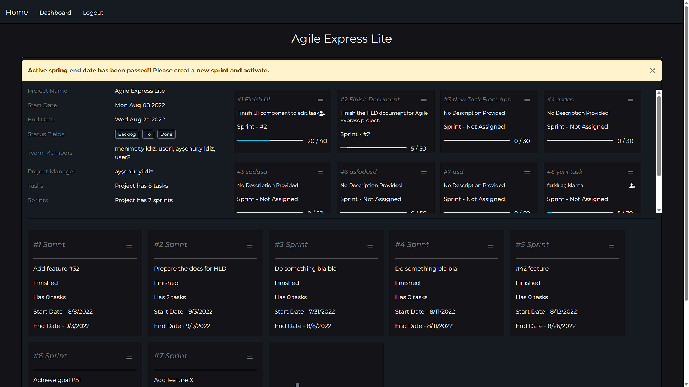
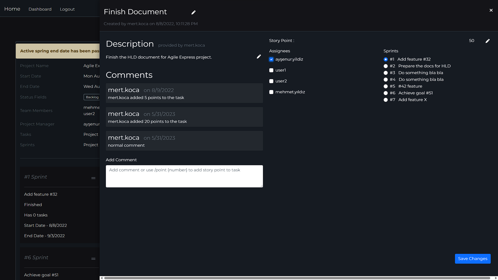

# Agile Express

Agile Express is the project I developed during my internship at OBSS.

During this internship I was expected to develop the application which its requirements were specified by the company.
Agile Express is a lightweight agile process management application.

• Backend: Spring Boot
• Frontend: React
• Database: MongoDB

Used indexing in MongoDB for search functionality.

## Functions of the Application

1. ##### Authentication

The app has built in LDAP authentication.

2. ##### Authorization

There are 4 types of users; system administrators, project managers, team leaders and team members. Each user type has different authority levels and actions they can do. For instance search functionality works differently for each user type.

3. ##### Dashboard Page

After login, user is redirected to the dashboard page.

- Project Manager: Project manager should see all of his/her projects in the dashboard page. PM also can access necessary functionalities to create a new project at the dashboard. PM can access, view and edit all properties of his/her projects through the dashboard and detail pages. PM can edit the project properties, tasks and sprints.
- Team Leader: Team leader sees his/her projects at the dashboard page. Team leader can access details of his/her projects. Team leaders can edit tasks in a given projects.
- Team Member: Sees his/her projects. Team members can view the details and tasks of a project.

Lastly, system administrators can view all the projects present in the database and their informations at the dashboard page. Sys adm can create, delete or edit any property of the projects. They can add or remove team members from a project, change tasks status and sprints, add or remove tasks and sprints.

4. ##### Project Creation and Board Page

After a project is created by a project manager, he/she should be able to assign team leader and add team members to said project. Upon creation, system automatically creates an empty *Backlog* and an *Active Sprint*. Each newly created task is assigned to Backlog as default. Afterwards they can be moved to any sprint by a project manager or team leader. 

Project board can be viewed by all team members. The tasks showed in the board are categorized to their status. The status of a task can be changed by project managers, team leaders or the assigned team members by dragging the task and dropping at desired status container. Tasks are assignable to project managers, team leaders and team members.

5. ##### Search Functionalities

Users should be able to search project name, project members, task names, task details. This functionality is presendted in the search bar at the dashboard page. Search function works according the authorization levels explained throughout this document.

6. ##### Tasks

Tasks can be created by project managers or team leaders. Upon creation task is placed at the *Backlog* and is *Unassigned*. Both PM or the team lead can add an task explanation, assign team members to task, add story points and estimated finishing time. 
Any assigned member to a task can change tasks status, and add story point or spend time. 

7. ##### Sprint Planning

Sprints can be created by PM or team leaders. PM or team leaders can take tasks from *Backlog* and assign them to a sprint. 

Some screenshots from the application;

To build project run `mvnw clean install`
To run the project run `mvnw spring-boot:run`